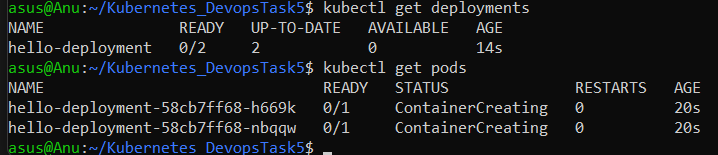
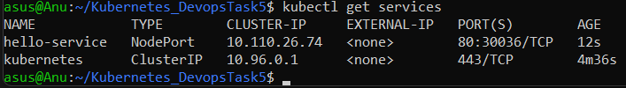
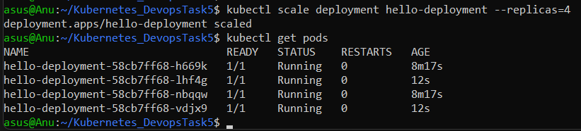

# ☸️ Kubernetes App Deployment with Minikube

---

## 📌 Overview

This project demonstrates how to **deploy, expose, and manage a simple NGINX application** on a **local Kubernetes cluster using Minikube**. The goal was to understand the fundamentals of Kubernetes objects like **pods, deployments, and services**, along with hands-on experience in scaling and debugging Kubernetes workloads.

---

## 🛠️ Tech Stack

| Tool/Platform | Purpose                              |
| ------------- | ------------------------------------ |
| Minikube      | Local single-node Kubernetes cluster |
| kubectl       | CLI to interact with the cluster     |
| Docker        | Container runtime for Minikube       |
| NGINX         | Web server used as the sample app    |
| YAML          | Declarative configuration for K8s    |
| GitHub        | Code version control & submission    |

---

## ⚙️ What Was Done

1. ✅ Installed **Minikube** and started a cluster using Docker as the driver
2. ✅ Wrote a **`deployment.yaml`** to deploy an NGINX app
3. ✅ Created a **`service.yaml`** to expose the deployment using a NodePort service
4. ✅ Verified the service works in the browser via `minikube service`
5. ✅ Scaled the deployment up using `kubectl scale`
6. ✅ Described pods and viewed logs for better understanding

---

## 🚀 How It Works

### 1. Start Minikube

```bash
minikube start --driver=docker
```

### 2. Apply Deployment

```bash
kubectl apply -f deployment.yaml
```

This creates a Deployment with 2 replicas of an NGINX pod.

### 3. Expose the App

```bash
kubectl apply -f service.yaml
```

Exposes the app using NodePort so it's accessible from your browser.

### 4. Access the App

```bash
minikube service hello-service
```

This opens the NGINX welcome page in your browser.

### 5. Scale the App

```bash
kubectl scale deployment hello-deployment --replicas=4
```

Scales the NGINX deployment to 4 pods.

---

## 📁 Project Structure

```
Kubernetes_DevopsTask5/
├── deployment.yaml        # Kubernetes Deployment manifest for NGINX
├── service.yaml           # Kubernetes Service (NodePort) to expose the app
├── screenshots/           # Folder containing all output images
│   ├── pods_output.png
│   ├── services_output.png
│   ├── scaling_output.png
│   ├── NGINX welcome page.png
│   ├── minikube service hello-service.png
│   ├── kubectl describe pod .png
│   └──  kubectl logs.png
│   
└── README.md              # Documentation
```

---

## 📷 Visual Walkthrough

<details>
<summary>Pods Output</summary>



</details>

<details>
<summary>Services Output</summary>



</details>

<details>
<summary>Scaling Deployment</summary>



</details>

<details>
<summary>Describe Pod Output</summary>


</details>

<details>
<summary>Logs Output</summary>


</details>

<details>
<summary>Service Access via Minikube</summary>


</details>

<details>
<summary>NGINX Welcome Page</summary>


</details>

---

## 🧠 What I Learned

* How to install and run a Minikube cluster locally
* Writing and applying Kubernetes manifests (YAML files)
* Difference between Kubernetes objects: pods, deployments, services
* How NodePort services work and allow local access
* Using `kubectl` to manage and troubleshoot Kubernetes resources
* Scaling deployments and verifying pod count
* Gathering and interpreting logs for containers

---

## 📚 Task Checklist

* [x] Minikube cluster created successfully
* [x] NGINX app deployed using `deployment.yaml`
* [x] App exposed using `service.yaml` (NodePort)
* [x] Accessed NGINX in browser
* [x] Scaled deployment to 4 pods
* [x] Described pods and checked logs

---
